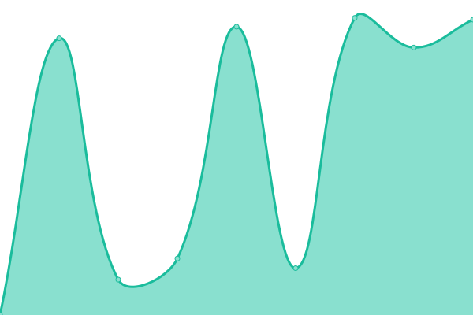

# [📈 Live Status](https://james-martinez.github.io/coderam-page): <!--live status--> **🟥 Complete outage**

This repository contains the open-source uptime monitor and status page for [James Martinez](https://james-martinez.github.io/coderam-page), powered by [Upptime](https://github.com/upptime/upptime).

With [Upptime](https://upptime.js.org), you can get your own unlimited and free uptime monitor and status page, powered entirely by a GitHub repository. We use [Issues](https://github.com/james-martinez/coderam-page/issues) as incident reports, [Actions](https://github.com/james-martinez/coderam-page/actions) as uptime monitors, and [Pages](https://james-martinez.github.io/coderam-page) for the status page.

<!--start: status pages-->
<!-- This summary is generated by Upptime (https://github.com/upptime/upptime) -->
<!-- Do not edit this manually, your changes will be overwritten -->
<!-- prettier-ignore -->
| URL | Status | History | Response Time | Uptime |
| --- | ------ | ------- | ------------- | ------ |
|  [Coderam.page](https://coderam.page) | 🟥 Down | [coderam-page.yml](https://github.com/james-martinez/coderam-page/commits/HEAD/history/coderam-page.yml) | 

 972ms
     
 | 

<a href="https://james-martinez.github.io/coderam-page/history/coderam-page">96.60%</a>
    

|  [Dns](https://dns.coderam.page) | 🟥 Down | [dns.yml](https://github.com/james-martinez/coderam-page/commits/HEAD/history/dns.yml) | 

 297ms
     
 | 

<a href="https://james-martinez.github.io/coderam-page/history/dns">99.62%</a>
    

<!--end: status pages-->

[**Visit our status website →**](https://james-martinez.github.io/coderam-page)

## 📄 License

- Powered by: [Upptime](https://github.com/upptime/upptime)
- Code: [MIT](./LICENSE) © [Anand Chowdhary](https://anandchowdhary.com), supported by [Pabio](https://pabio.com)
- Data in the `./history` directory: [Open Database License](https://opendatacommons.org/licenses/odbl/1-0/)
